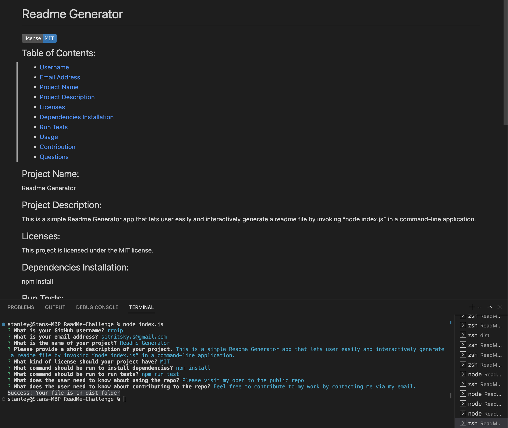

# Readme Generator

## Description

This is a simple README GENERATOR application to assist the user with creation of their own readme file guiding through the process via command-line application. 

The application can be invoked by node index.js command and follow through the questionere.

## Usage

Video presentation of application [Readme Generator](https://drive.google.com/file/d/1oVDfVBdHxIfujO-5Giuvdo5w2XHwXIy_/view)

Repo for app can be found at https://github.com/rroip/ReadMe-Challenge
